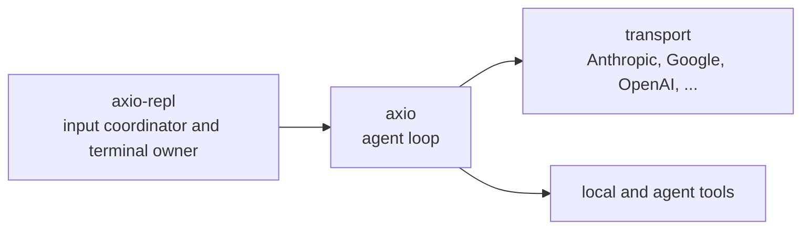

# axio-repl

Interactive REPL coding assistant powered by the [axio](../axio) agent framework.
Works with any LLM backend via pluggable transports — bring your own API key.

## Philosophy

axio-repl is an opinionated terminal agent that **actually verifies its work**.
The system prompt encodes hard-won lessons from watching models cut corners:

- **Keep evidence aligned.** Tool arguments, stdout/stderr, images, and exit
  codes reach the model through the tool/context path instead of being silently
  replaced by a more convenient story. Presentation-only suppression is marked
  explicitly in the terminal. Background prose may be hidden from the active
  stream, but its final report and relevant events still use the normal context
  path.
- **Not tested — not done.** The agent must run tests, re-read edited files,
  and observe actual results instead of assuming success from exit codes.
- **Iterative UI review.** When building or modifying UI, the agent captures
  real screenshots at multiple viewport sizes (desktop, tablet, mobile) via
  Playwright/Puppeteer, reads every screenshot through the model's vision, and
  critically lists visual defects. It repeats the screenshot → fix → re-screenshot
  loop until zero defects — no premature "looks good".
- **Ground everything in project context.** Read before editing. List the
  directory before guessing. Never refuse a safe request.
- **Minimal edits.** Don't reformat surrounding code, don't narrate tool calls.
  The user sees the full tool output in the terminal.

## Features

- **Pluggable transports** — auto-detected from API keys via
  `axio.transport` entry points. Ships with support for OpenAI, Anthropic,
  Google (Gemini API & Vertex AI), Nebius, OpenRouter, and Codex.
- **Runtime model switching** — `/model <query>` to switch models mid-session
  without restarting. Capabilities (vision, reasoning, image generation) are
  re-evaluated and the system prompt adapts automatically.
- **Streaming tool arguments** — completed single-line fields render inline;
  multiline fields switch to an unindented block at their first decoded newline.
- **Streaming tool output** — tagged shell stdout/stderr chunks appear as soon
  as the executor observes them instead of waiting for completion or a newline.
- **Vision** — `read_file` on images (PNG, JPG, GIF, WebP) and videos returns
  multimodal content blocks. The model sees the actual pixels, not a description.
- **Image & video generation** — when the Google transport is installed,
  `generate_image` and `generate_video` tools are available for Gemini Nano
  Banana / Veo models.
- **AGENTS.md** — workspace-level instructions loaded into the system prompt from
  an `AGENTS.md` file in the working directory.
- **Multiline paste** — bracketed multi-line paste remains one editor value and
  becomes one message when Enter is pressed.
- **Graceful interruption** — Escape cancels the captured agent turn without
  submitting the editor and preserves available partial output for context or
  recovery.
- **Prompt history** — `prompt_toolkit` history is persisted across sessions in
  `~/.axio_repl_history` after input has been claimed by an agent.
- **Terminal scrollback** — interactive output stays on the primary screen
  buffer; only the editor and status line are temporary redrawable UI.
- **Session logs** — a private semantic JSONL records resumable conversation
  state without token-level reasoning noise; exact terminal/input replay is a
  separate explicit opt-in.
- **Single-prompt mode** — pass a prompt as argument for scripting and non-interactive use.

## Interactive controls

- **Enter** queues the current editor as one user message without interrupting
  the active turn. At the bounded pending limit, the prompt remains active for
  Escape and Up, and an additional submission is restored to the editor instead
  of being dropped.
- **Up** recalls all user messages not yet claimed by an agent and joins their
  text in the editor with an empty line between messages. With no pending input,
  it falls back to normal prompt history or multi-line cursor movement.
- **Escape** interrupts the captured turn and delivers only messages previously
  submitted with Enter. Pending messages remain separate conversation objects;
  editor text is never submitted or changed by Escape. Without pending user
  input, no replacement model turn starts.
- **Ctrl-D** on an empty editor warns once; a second press within two seconds
  closes input, lets the active turn and already submitted work drain, then
  exits without starting another editor prompt.
- **Ctrl-C** starts graceful shutdown. It does not submit or clear the editor;
  the shutdown journal retains it for `--resume`.

A lone Escape has a 200 ms disambiguation timeout. It is bound eagerly, so the
usual escape-prefixed Alt+B/Alt+F word-motion bindings are unavailable.

## Install

```bash
uv tool install axio-repl
```

To add optional transports:

```bash
uv tool install axio-repl --with axio-transport-anthropic
uv tool install axio-repl --with axio-transport-google
```

Or within the monorepo workspace:

```bash
uv run axio-repl
```

`axio-repl` is POSIX-only. Interactive mode uses POSIX terminal input state and
does not support Windows. It never enters the alternate screen or installs a
scroll region: normal output remains in terminal scrollback while one serialized
owner erases and redraws the temporary `prompt_toolkit` editor around
asynchronous stdout, stderr, logging, and agent output. Bounded output overload
and late writes are represented by explicit skip markers, and terminal state is
restored during shutdown or failure handling. Model text, tool arguments, tool
output, and results are incrementally stripped of terminal control sequences,
including controls split across streaming chunks. Application-owned ANSI styles
are reset and re-established on each physical line so reasoning or tool colours
cannot leak into a later answer block.

Tool argument presentation does not expose provider transport chunks. The
renderer buffers a field until its first decoded newline or completion. A
single-line value is then shown inline; the first newline instead produces one
parameter header followed by value lines at column zero. Complete natural lines
stream immediately and only the unfinished tail remains buffered. A long
newline-free value is intentionally retained until completion, so display memory
for that field grows with its sanitized length.

Every tool call and response has a correlated session-local badge. Calls use
`▶ write_file #001`; successful responses use `✓ write_file #001`, and errors
use `✗ write_file #001`. The number is a monotonic REPL-process ordinal, not a
shortened provider ID. It remains stable through arguments and streamed output,
expands naturally after `#999`, and resets only when a new REPL process starts.
The provider ID in events, context, and the session journal is unchanged. A
response badge is still shown when the result body is empty, already streamed,
or intentionally omitted as a redundant write acknowledgement. Powerline mode
uses filled badges; `NO_COLOR` keeps the glyphs, names, and numbers without ANSI.

Parameter headers carry a one-cell tool-coloured background margin followed by
a normal separating space. Consecutive headers therefore form a narrow vertical
stripe, while multiline value rows have no margin or indentation added by the
renderer. `NO_COLOR` omits the margin cell and separator completely. For example,
the ANSI-stripped coloured layout is:

```text
  path: .
  content:
first line
  indentation belongs to the value
  mode: overwrite
```

If submitted input, an incoming message, or a tool-call or agent source switch
must be inserted while a value tail is incomplete, the renderer first commits
that tail as a block line, performs the insertion, and resumes the same block at
column zero. The parameter label is never repeated. The exact incremental JSON
stream still goes to the tool argument parser unchanged; these rules affect only
its terminal projection.

The bottom panel shows whether the active agent is idle, waiting for the model,
reasoning, responding, or running named tools. Startup details, command output,
queue warnings, background lifecycle summaries, and interruption causes stay in
that temporary panel instead of entering terminal scrollback or model context.
Slash-command acceptance is not journaled as user input; durable command effects
are recorded separately as configuration changes.

## Usage

```bash
# Interactive REPL (auto-detects transport from API keys)
axio-repl

# Identify the installed entry point, imported source, interpreter, and checkout
axio-repl --version

# Single prompt (non-interactive)
axio-repl "list the files in this project"

# Explicit transport and model
axio-repl --transport anthropic --model claude-sonnet-4-20250514

# Google Gemini
axio-repl --transport google --model gemini-3.1-pro-preview

# Custom temperature and iteration limit
axio-repl --temperature 0.5 --max-iterations 100

# Set reasoning effort when the transport supports it, otherwise use prompt guidance
axio-repl --effort high

# Choose another journal root, or explicitly opt out
axio-repl --session-log-dir ./axio-session-logs
axio-repl --no-session-log

# Opt in to an exact binary terminal/input replay (records raw keystrokes)
axio-repl --session-replay

# Resume an interrupted interactive session into a new journal
axio-repl --resume ~/.local/state/axio/sessions/2026/08/14/<session>/session.jsonl

# Show framed tool and lifecycle actions from background agents
axio-repl --agent-actions on

# Use the plain presentation instead of the interactive Powerline default
axio-repl --no-powerline

# Use the high-contrast monochrome terminal palette
axio-repl --theme monochrome
```

Interactive TTY sessions use Powerline by default. It requires a terminal font that provides the `U+E0B0` (``)
separator glyph; use `--no-powerline` when that glyph is unavailable.
The active editor prompt shows only the effective-UID username (`username>` in plain mode or a
filled ` username ` Powerline segment). The default theme renders that label as black text on a
white background; editor and submitted-message text after the label return to the terminal's normal
foreground and background. When Enter accepts a user message, its persistent scrollback line is
stamped with the local `HH:MM` captured at that keypress. Queueing and model startup delays do not
change it. Terminal recordings therefore expose the local username and submission times. Built-in
themes are `default` and `monochrome`; unknown names stop startup.

Set `NO_COLOR` to disable application-owned ANSI styling. It takes precedence
over `--theme` and also disables Powerline. One-shot output automatically uses
the same plain presentation when stdout is not a TTY, so redirected output does
not contain ANSI colour sequences or Powerline glyphs.

## Agent configuration

Persistent defaults live in `~/.config/axio/config.yaml` (or
`$XDG_CONFIG_HOME/axio/config.yaml`). Named bundles live under
`~/.config/axio/agents/<name>/agent.yaml` and run with `--agent <name>`.
`AXIO_CONFIG_DIR` or `--config-dir` selects another root.

```yaml
# ~/.config/axio/agents/local/agent.yaml
version: 1
model_context: |-
  Network access is routed through the configured local policy proxy.
transport:
  name: llama-cpp
  base_url: http://127.0.0.1:18080/v1
sandbox:
  backend: docker
  network: axio-agent-egress
  registries:
    pypi: http://devpi:3141/root/pypi/+simple/
runtime:
  theme: default
```

```bash
axio-repl --list-agents
axio-repl --agent local
```

Resolution is built-ins, global defaults, agent bundle, `AXIO_REPL_*`
environment, then explicit CLI flags. YAML is versioned and strict: unknown or
duplicate fields, escaping relative paths, missing instruction files, and
missing secret references stop startup. LLM credentials use
`transport.api_key_env`; secret values do not belong in YAML. See the
[REPL guide](../docs/guides/axio-repl.md#persistent-configuration-and-agent-bundles)
for the complete schema and sandbox registry mapping.

`model_context` is optional trusted operator text from the selected agent
manifest only. It is passed unchanged to the main and local child agents as
descriptive context; it does not enforce the policy it describes. Do not place
credentials or untrusted external content there.

## Session logs, replay, and privacy

Semantic journaling is enabled by default. Each invocation creates:

```text
${XDG_STATE_HOME:-~/.local/state}/axio/sessions/YYYY/MM/DD/<session-id>/session.jsonl
```

The semantic log contains submitted input, committed context messages (including
complete tool calls and results), configuration and lifecycle changes, delivery
correlation, and sparse checkpoints for unfinished text/tool fragments. Raw
token-level text, tool, and reasoning deltas are not copied into it; reasoning
is not resumable state. The result is readable and greppable while still being
the sole input to `--resume`.

The REPL prints the semantic path when the session starts. In single-prompt mode
it prints the path to stderr, leaving the streamed answer on stdout. Use
`--session-log-dir <directory>` to select another root or `--no-session-log` to
disable journaling.

`--resume <session.jsonl>` validates a stopped semantic journal, replays its
main-agent context, restores pending input and the last durable editor snapshot,
and materializes available partial text, tool arguments, and tool output from
unfinished main and background-agent turns. Unavailable background
contexts and cancelled deferred tools become labelled notices in the restored
main context with their original identities. Resume creates a new journal and
records which recovery artifacts were applied. Continue a recovery chain from
that new journal; `--resume` cannot be combined with `--no-session-log` or
one-shot mode. Legacy schema-v1 `events.jsonl` files remain accepted.

`--session-replay` additionally creates `replay.axrp` for interactive sessions.
It is a versioned binary stream of individually zlib-compressed records with a
monotonic nanosecond offset. Records include ordered terminal output operations,
parsed keypresses, editor states, accepted submissions, and runtime events. It
is intended for deterministic UI diagnostics and fixtures; `--resume` never
depends on it.

Replay is off by default because it deliberately records raw keystrokes and
editor contents. Those frames are not secret-redacted: redaction would make an
exact replay dishonest and still could not reliably identify arbitrary pasted
credentials. Replay files have no automatic expiry; enable them only for a
bounded diagnostic session and apply an explicit retention policy.

Binary media referenced by semantic messages is stored by hash under the
session's `attachments/` directory. Directories are created with mode `0700`
and semantic, replay, and attachment files with `0600`.

The initial semantic `session_start` record is fsynced before the REPL starts
normal session work. Semantic records are admitted to a bounded memory queue
without an fsync per event. Successfully committed context mutations, completed turns,
outcome deliveries, pending-input transitions, interruption barriers, editor
snapshots, recovery application, and stopped agents are durability boundaries:
each drains and fsyncs every earlier accepted record. A clean shutdown also
drains the queue, writes `session_end`, and fsyncs it.

After abrupt process termination, all records through the last successful
durability boundary are retained. Records accepted after that
boundary are explicitly best-effort: all of them may be lost, or a prefix may
be present. Any present data remains valid newline-delimited JSON except for at
most one final unterminated line interrupted during `write(2)`. Journal readers
may ignore that final tail; `recover_journal_tail()` validates the earlier
prefix before truncating it. Corruption in a newline-terminated or non-final
record is not treated as a crash tail.

Storage-media corruption and filesystem failures outside this interrupted-tail
model are reported as corruption; the reader does not silently skip them.

Known secret-shaped fields and common token formats are redacted before writing the semantic log,
but arbitrary secrets embedded in prose or tool output cannot be identified
reliably. Treat both artifacts as sensitive local session data.

## REPL Commands

Command feedback appears in the temporary bottom panel. A command that is unsafe
to apply during an active turn waits in a UI-only command queue until the next
turn boundary; it never becomes a pending conversation message.

| Command              | Description                                    |
|----------------------|------------------------------------------------|
| `/help`              | Show available tools and commands               |
| `/agent-actions`     | Show whether other agents' actions are visible  |
| `/agent-actions on\|off` | Toggle framed actions from other agents    |
| `/agents`            | List local background agents                    |
| `/agent-focus <id>`  | Change the input target                         |
| `/agent-interrupt [id]` | Interrupt a background agent's current turn |
| `/agent-stop [id]`   | Stop a background agent                         |
| `/model`             | Show current model and list available models    |
| `/model <query>`     | Switch to a model matching the query            |
| `/effort [level]`    | Show or set effort; `default` resets it          |
| `/temperature [val]` | Show or set sampling temperature                |
| `/max-tokens [val]`  | Show or set maximum output tokens               |
| `/iterations [val]`  | Show or set the agent iteration limit           |
| `/debug [on\|off]`   | Show or toggle transport debug logging          |
| `/quit` `/exit` `/q` | Exit the REPL                                   |

## Foreground and background agents

`run_agent` executes one bounded child turn in the foreground. Its reasoning,
text, tool arguments, and streaming tool output use the same immediate terminal
path as the parent. The input target does not change, and the child's final text
is returned to the parent exactly once as the `run_agent` tool result.

Each live-streamed turn starts with a source header. The root answer in
single-prompt mode is the exception: it keeps its plain stdout projection
without a header. When an agent has a human name, headers, action frames,
summaries, errors, and incoming reports identify it as `name (agent_id)`;
otherwise they show the authoritative agent id.

If another parent tool streams concurrently with the foreground child, its
labelled output is inserted at the child's next safe boundary. This active
parent work remains visible even when agent actions are off, without splitting
the child's paragraph, reasoning, arguments, or tool output.

`spawn_agent` starts a persistent background peer. By default, its prose and
actions stay out of the active stream and the REPL prints a completion summary.
Use `/agent-actions on` (or start with `--agent-actions on`) to show its complete
tool calls, ordered channel-tagged tool output, results, errors, and lifecycle
changes.
These labelled frames appear only after a complete active paragraph, after
reasoning closes, after media, or after every active parallel tool call has
finished. Background prose and reasoning remain hidden.

The action toggle changes terminal presentation only. It neither changes which
agent receives input nor affects execution, outcome delivery, context, or the
session journal. Queues are bounded; overload is represented by a labelled
suppression frame rather than delaying the active stream. Enabling the mode does
not replay actions that occurred while it was off.

In single-prompt mode, the REPL waits for spawned background agents and displays
each final report through normal incoming-outcome delivery. It does not focus a
background agent or replay that agent's hidden prose before displaying the
report.

User input, peer messages, background outcomes, interrupts, and deferred-tool
results share one monotonic session order. Enter reserves its sequence before
the prompt accepts a later event, and an ordered batch remains a batch of
distinct conversation messages.

If a new arrival occurs while the active turn is blocked in a tool dispatch,
the REPL closes the interrupted tool protocol with a placeholder and lets the
session-owned call continue. The actual result is delivered once, later, as a
labelled user message at the earliest safe model boundary. It is not emitted as
a duplicate `ToolResult`. Shutdown cancels unresolved deferred calls and records
their identities for `--resume`.

## Tools

| Tool            | Description                                                    |
|-----------------|----------------------------------------------------------------|
| `read_file`     | Read file contents; images and videos returned as vision blocks |
| `write_file`    | Create or overwrite files with UTF-8 text                       |
| `patch_file`    | Replace line ranges in UTF-8 text files (1-indexed, inclusive)   |
| `list_files`    | List directory contents                                         |
| `search_files`  | Text/regex search across files                                  |
| `shell`         | Run shell commands with streaming output and process-group cleanup |
| `generate_image` | Generate images via Gemini Nano Banana (Google transport only) |
| `generate_video` | Generate videos via Veo (Google transport only)                |
| `list_peers`     | List running local agents                                      |
| `send_message`   | Send a message to a local agent by global id                    |
| `run_agent`      | Run one foreground child turn and return its final answer       |
| `spawn_agent`    | Start a persistent background child agent                      |
| `monitor`        | Wait for agents, tasks, paths, processes, or messages           |
| `interrupt_agent` | Interrupt a background agent's current turn                   |
| `stop_agent`     | Stop a background agent                                         |

## Transports

Transports are discovered via the `axio.transport` entry point group.
The REPL picks the first transport whose required environment variable is set:

| Transport        | Env Variable                   | Package                    |
|------------------|--------------------------------|----------------------------|
| `google`         | `GEMINI_API_KEY`               | `axio-transport-google`    |
| `google-vertex`  | `GOOGLE_GENAI_USE_VERTEXAI`    | `axio-transport-google`    |
| `anthropic`      | `ANTHROPIC_API_KEY`            | `axio-transport-anthropic` |
| `openai`         | `OPENAI_API_KEY`               | `axio-transport-openai`    |
| `nebius`         | `NEBIUS_API_KEY`               | `axio-transport-openai`    |
| `openrouter`     | `OPENROUTER_API_KEY`           | `axio-transport-openai`    |
| `codex`          | *(API key varies)*             | `axio-transport-codex`     |

Use `--transport <name>` to force a specific transport regardless of env vars.

## Capability-Aware System Prompt

The system prompt adapts based on the selected model's declared capabilities:

- **Vision** — unlocks instructions to `read_file` images and do screenshot-based
  UI review.
- **Reasoning** — notes that extended thinking is available.
- **Image generation** — enables inline image generation guidance.
- **Video** — enables `read_file` for video content.
- **Tool use** — gates all tool-related rules (edit workflow, testing, verification).

This means switching from a text-only model to a vision model mid-session
(via `/model`) automatically updates what the agent is instructed to do.

## Architecture



- **axio-repl** owns `prompt_toolkit` input, chronological coordination, the
  serialized primary-buffer renderer, recovery, and REPL commands.
- **axio** runs the agent loop: dispatch tools, manage conversation context,
  handle cancellation.
- **transports** handle LLM communication — message conversion, streaming,
  model registries.
- **axio-tools-local** provides the file and shell tools.
