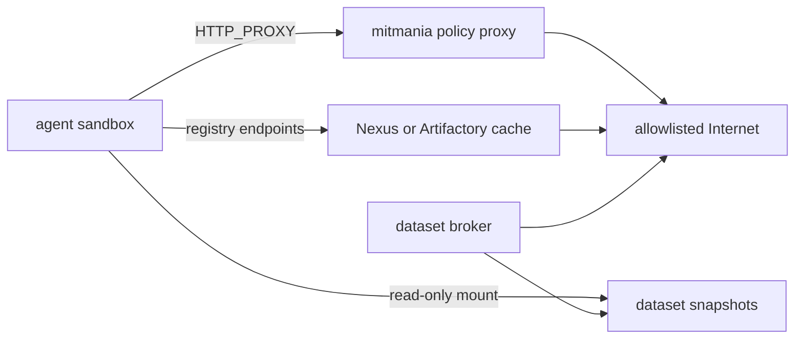

# Docker Sandbox

The `axio-tools-docker` package provides an isolated Docker container for
running agent-generated code and commands. `DockerSandbox` is an async context
manager: it creates a container on entry and removes it on exit. Inside the
context it exposes six tools that are drop-in replacements for
`axio-tools-local` - the agent gets the same `shell`, `write_file`,
`read_file`, `list_files`, `run_python`, and `patch_file` tools, but every
operation runs inside the container, not on the host.

## Installation

```bash
pip install axio-tools-docker
```

Docker must be installed and running on the host. The package communicates with
the Docker Engine API directly via
[aiodocker](https://aiodocker.readthedocs.io/) - the `docker` CLI is not
required.

## Quick start

<!-- name: test_docker_quick_start; fixtures: docker -->
```python
import asyncio
from axio import Agent, MemoryContextStore
from axio.testing import StubTransport, make_text_response
from axio_tools_docker import DockerSandbox

async def main() -> None:
    transport = StubTransport([make_text_response("Done.")])
    async with DockerSandbox(image="python:3.12-alpine") as sandbox:
        agent = Agent(
            system="You are a coding assistant. Use the sandbox tools.",
            tools=sandbox.tools,
            transport=transport,
        )
        result = await agent.run("Print hello from Python.", MemoryContextStore())
        print(result)

asyncio.run(main())
```

## Sandbox tools

The six tools exposed by `sandbox.tools` have the same names and field schemas
as `axio-tools-local`, so switching between local and sandboxed execution
requires changing only the tool list passed to `Agent`.

| Tool | Description |
|------|-------------|
| `shell` | Run a shell command with streaming stdout/stderr. Supports `timeout`, `cwd`, and `stdin`. |
| `write_file` | Create or overwrite a file. Parent directories are created automatically. Accepts `file_path`, `content`, and optional `mode`. |
| `read_file` | Read a file with optional `start_line`/`end_line`, `line_numbers`, and `max_chars` truncation. Binary files return hex. |
| `list_files` | List immediate directory entries without reading descendant contents. Directories appear first with a trailing `/`. |
| `run_python` | Execute a Python snippet in a subprocess inside the container. Supports `timeout`, `cwd`, and `stdin`. |
| `patch_file` | Replace lines `from_line`..`to_line` (1-indexed, inclusive). Set `to_line = from_line - 1` to insert without deleting. Always read the file first with `line_numbers=True`. |

The `tools` property is only valid inside the `async with` block. Accessing it
outside raises `RuntimeError`.

## From axio-repl

`axio-repl --sandbox docker` builds the same sandbox for you. The default is
`--sandbox auto`, which uses a container whenever `aiodocker` is importable and
`/var/run/docker.sock` exists — on a machine with Docker running, the agent is
sandboxed unless you pass `--sandbox none`.

The REPL preserves the invoking process identity and project path. Conceptually,
without network options it creates the container as:

```text
DockerSandbox(
    image=<--sandbox-image>,
    user="<host uid>:<host gid>",
    group_add=[<host supplementary gids>],
    volumes={<absolute cwd>: <absolute cwd>, "/tmp/axio-home": <temporary host directory>},
    read_only_volumes={"/etc/passwd": "/etc/passwd", "/etc/group": "/etc/group"},
    workdir=<absolute cwd>,
    network=False,
)
```

The system prompt and tools therefore use the same absolute project path as the
host. Files created through `write_file` are archived with the numeric runtime
UID/GID instead of becoming root-owned on the host. `HOME=/tmp/axio-home` is a
writable, per-session bind mount backed by a host temporary directory; it is
removed with the sandbox. The real host home is never mounted, and CLI caches
and configuration do not spill into the project.

The defaults give the agent **256 MB of memory and one CPU** — enough for edits
and small scripts, tight for a test suite or a compiler. Override them with
`--sandbox-memory` and `--sandbox-cpus`.

Tools are swapped by name:

| Tool | Where it runs |
|---|---|
| `read_file`, `write_file`, `patch_file`, `list_files`, `shell` | replaced by the container-backed versions |
| `search_files` | reimplemented for the container: the search script is copied in and run with `python3` |
| `ast_grep` | runs `ast-grep` **inside** the container |
| `run_python` | offered only in the sandbox — running arbitrary Python on the host is what the sandbox exists to prevent |
| `spawn_agent`, `send_message`, `list_peers`, `monitor`, `stop_agent`, `interrupt_agent` | left on the host; they touch no files |

Spawned subagents inherit the parent's tools, so one substitution covers the
whole tree.

### Standard agent image

The repository contains a moderately sized universal image based on
`mcr.microsoft.com/devcontainers/base:3-noble`. It includes Python/uv, Node.js,
Go, Rust, OpenJDK, Git, `gh`, `glab`, PDF/OCR utilities, a Python data-analysis
environment, and Kaggle/Hugging Face CLIs.

```bash
make sandbox-image
axio-repl --sandbox docker \
  --sandbox-memory 4g \
  --sandbox-cpus 2
```

`axio-agent-sandbox:standard` is the REPL default. It is deliberately local-only
and is not pulled from a registry: when absent, startup stops with the command
to run `make sandbox-image`. An explicit alternative such as
`--sandbox-image python:3.12-slim` retains the generic Docker behavior and is
pulled when missing. See `docker/agent-sandbox/README.md` for the exact inventory
and build arguments. Keep `python3` in derivative images:
`search_files` and `run_python` both need it.

Dependencies must be baked in for the same reason — with networking off, a
`uv sync` inside the container cannot reach an index. The next section describes
restricted registry access without enabling Docker's routed default network.

### Host identity limitations

Host identity projection is intentionally limited to a local POSIX Docker
client. REPL sandbox startup fails when numeric UID/GID APIs or `/etc/passwd`
and `/etc/group` are unavailable. It also verifies the effective UID/GID,
supplementary numeric group IDs, NSS resolution of the current user and primary
group, exact workdir, writable project and temporary home, and read-only account
database mounts before exposing tools to the agent. Root invocation therefore
runs as root; the REPL does not invent a safer identity.

Both `--sandbox auto` and `--sandbox docker` fail closed when this projection or
its startup verification fails; neither falls back to host tools. Use
`--sandbox none` to make host execution an explicit choice.

Only `/etc/passwd` and `/etc/group` are exposed. `/etc/shadow`, `/etc/gshadow`,
and the host home are not mounted. Supplementary GIDs supplied by an NSS source
other than `/etc/group` remain usable numerically but may not resolve to names
inside the container.

The current user and primary group must exist in the mounted files. Accounts
resolved only through LDAP, SSSD, systemd-homed, macOS Directory Services, or
another non-file NSS backend are not reproduced by these two mounts, so startup
fails instead of running under an unresolved identity. In particular, macOS
Docker Desktop is POSIX on the client side but normally cannot project the
interactive macOS account through its host `/etc/passwd`; use `--sandbox none`
unless a file-based identity visible to the Linux container is configured.

Bind source paths are interpreted by the Docker daemon. A remote daemon cannot
see ordinary client paths, so its mount or the startup verification fails; the
REPL does not silently fall back to another identity or path. Nested mounts are
required when a project lies below `/tmp/axio-home` or includes `/etc`; Docker
on Linux supports them, but unusual daemon/storage configurations can reject
them. An exact collision with `/tmp/axio-home`, or mounting `/` as the project,
is rejected before container creation. Project paths containing `:` are also
rejected because Docker's bind-string representation cannot encode them safely.

### Restricted packages and datasets

Axio does not deploy a proxy, registry cache, or dataset broker. It validates
the sandbox network, injects client configuration, and mounts operator-provided
files. The surrounding infrastructure enforces policy and obtains approved
artifacts.

Registry and proxy settings route well-behaved clients; they are not a security
boundary. An agent can change environment variables or pass a different
registry on a command line. The boundary that prevents direct Internet egress
is a Docker network with `Internal=true`, plus firewalling on services that
have upstream access.

#### Network topology

Create a user-defined internal network and attach only the sandbox and trusted
service endpoints to it:

```bash
docker network create --internal axio-agent-egress
```

A typical deployment connects these components:



The sandbox is attached only to `axio-agent-egress`, which has Docker
`Internal=true`. mitmania, the package cache, and the dataset broker need a
separately controlled upstream path. Do not attach the sandbox itself to that
upstream network.

mitmania is an HTTP/HTTPS policy data plane, not a package cache and not a
containment boundary. Its own documentation requires a firewall or equivalent
network boundary to prevent direct egress. An internal Docker network supplies
that boundary for this topology; mitmania supplies per-host/path/method policy,
auditing, and optional TLS interception. Nexus or Artifactory supplies caching
and repository grouping.

Point the REPL at those internal services explicitly:

```bash
axio-repl --sandbox docker \
  --sandbox-image axio-agent-sandbox:standard \
  --sandbox-memory 4g \
  --sandbox-cpus 2 \
  --sandbox-network axio-agent-egress \
  --sandbox-proxy http://mitmania:3128 \
  --sandbox-no-proxy nexus.internal \
  --sandbox-pypi-index https://nexus.internal/repository/pypi-all/simple \
  --sandbox-npm-registry https://nexus.internal/repository/npm-all/ \
  --sandbox-cargo-index sparse+https://nexus.internal/repository/cargo-all/ \
  --sandbox-go-proxy https://nexus.internal/repository/go-all/ \
  --sandbox-go-sumdb 'sum.golang.org https://nexus.internal/repository/go-sumdb/' \
  --sandbox-ca-cert /srv/axio-pki/egress-ca-bundle.pem \
  --sandbox-datasets /srv/axio-datasets
```

`axio-repl` verifies that the named Docker network has `Internal=true` before
creating the container, then creates it against that verified network ID rather
than looking it up again by name. Missing, malformed, replaced, and routed
networks fail closed. Proxy and registry flags, read-only data mounts, CA
configuration, and non-default resource limits are rejected instead of silently
falling back to the host when `--sandbox none` is selected or `--sandbox auto`
cannot use Docker.

#### Cache service recipes

The examples below assume two Docker networks:

```bash
docker network create --internal axio-agent-egress
docker network create axio-registry-upstream
```

The sandbox joins only `axio-agent-egress`. A cache service needs a controlled
route to its public upstream, either by joining `axio-registry-upstream` or by
using an organization egress proxy. For a local evaluation, the cache container
can also join `axio-agent-egress` directly. In production, expose a separate
download-only TLS frontend to the sandbox network and keep the cache's
administration UI and API on a management network.

The examples use `VERSION` as an image-tag placeholder. Replace it with a
reviewed, pinned release; do not use a floating `latest` tag. Give the sandbox
anonymous read access only to the dedicated proxy or group endpoints. If
authentication is mandatory, let the download-only frontend inject a narrowly
scoped token. Axio rejects credentials in the PyPI URL and does not provide a
dedicated secret channel for package-manager credentials.

##### devpi

[devpi](https://devpi.net/docs/devpi/devpi/stable/+doc/index.html) is the
smallest option when only Python packages need caching. Its default `root/pypi`
index is an on-demand PyPI mirror; devpi does not proxy npm, Cargo, or Go.

Install a pinned release on a dedicated service host, initialize persistent
storage once, and then run the server under the same unprivileged service
account:

```bash
DEVPI_VERSION=6.20.3
uv tool install "devpi-server==$DEVPI_VERSION"
: "${DEVPI_ROOT_PASSWORD:?set from a secret manager before initialization}"
devpi-init --serverdir /srv/devpi --root-passwd "$DEVPI_ROOT_PASSWORD"
unset DEVPI_ROOT_PASSWORD
devpi-server --serverdir /srv/devpi --host 0.0.0.0 --port 3141 \
  --restrict-modify root
```

Supply `DEVPI_ROOT_PASSWORD` from a secret manager before initialization; do
not store it in this file or shell history. Initialize before exposing the
service. `--restrict-modify root` prevents anonymous clients from creating
users and indexes, while the `root/pypi` mirror remains readable.

For a permanent deployment, use a devpi YAML configuration and a service
manager instead of leaving the foreground process in a shell. Put the HTTP
service behind an internal TLS reverse proxy if traffic can leave a single
trusted host or Docker network. The
[mirror quickstart](https://devpi.net/docs/devpi/devpi/stable/+doc/quickstart-pypimirror.html)
and
[permanent-install guide](https://devpi.net/docs/devpi/devpi/stable/+doc/quickstart-server.html)
describe initialization, generated service configurations, and reverse-proxy
settings.

The following command assumes that the service is reachable from
`axio-agent-egress` as `devpi`. That can be a container joined to the network,
or an internal DNS name on a frontend that routes to the dedicated service
host. Point Axio at the Simple API endpoint:

```bash
axio-repl --sandbox docker \
  --sandbox-network axio-agent-egress \
  --sandbox-pypi-index http://devpi:3141/root/pypi/+simple/
```

An HTTP endpoint is acceptable only on the isolated internal network. Axio
derives `PIP_TRUSTED_HOST` and `UV_INSECURE_HOST` for this case. Prefer HTTPS
and `--sandbox-ca-cert` when a TLS frontend is available.

devpi caches packages on demand. A network outage does not make uncached
packages available, so prefetch every locked artifact required for an offline
run. If private packages are needed, create a stage index based on `root/pypi`
and expose only that index; devpi index inheritance prevents public packages
from silently replacing a private package of the same name by default.

##### Nexus Repository

For a local single-node evaluation, start the official image with persistent
storage and a pinned `VERSION`:

```bash
docker volume create nexus-data
docker run -d --name nexus \
  --network axio-registry-upstream \
  -p 127.0.0.1:8081:8081 \
  -v nexus-data:/nexus-data \
  sonatype/nexus3:VERSION
docker network connect axio-agent-egress nexus
```

The direct connection in this example exposes the Nexus application port to
the sandbox network and is therefore for evaluation only. For production, put
a path- and method-restricted TLS frontend on `axio-agent-egress` and keep
`/service/rest/`, the UI, and administrative endpoints inaccessible from the
sandbox.

After completing the initial administrator setup, open
`Settings → Repository → Repositories → Create repository` and create these
proxy repositories:

| Recipe | Name | Remote storage |
|---|---|---|
| `pypi (proxy)` | `pypi-proxy` | `https://pypi.org/` |
| `npm (proxy)` | `npm-proxy` | `https://registry.npmjs.org/` |
| `cargo (proxy)` | `cargo-proxy` | `https://index.crates.io/` |
| `go (proxy)` | `go-proxy` | `https://proxy.golang.org` |
| `raw (proxy)` | `go-sumdb` | `https://sum.golang.org` |

The Cargo remote URL must end in `/`. For `go-sumdb`, disable Strict Content
Type Validation as required by the Nexus Go setup. The Go proxy stores module
content but not checksum-database responses; the raw proxy supplies the
separate checksum endpoint.

If internal packages are also served, create corresponding hosted repositories
and group repositories named `pypi-all`, `npm-all`, `cargo-all`, and `go-all`.
Put the hosted repository before the public proxy in each group and grant the
sandbox principal read access only to the group. Otherwise use the proxy
repository names directly in the URLs below.

The command below assumes the production TLS frontend is reachable as
`nexus.internal` and presents a certificate signed by the supplied CA bundle:

```bash
axio-repl --sandbox docker \
  --sandbox-network axio-agent-egress \
  --sandbox-proxy http://mitmania:3128 \
  --sandbox-no-proxy nexus.internal \
  --sandbox-pypi-index https://nexus.internal/repository/pypi-all/simple \
  --sandbox-npm-registry https://nexus.internal/repository/npm-all/ \
  --sandbox-cargo-index sparse+https://nexus.internal/repository/cargo-all/ \
  --sandbox-go-proxy https://nexus.internal/repository/go-all/ \
  --sandbox-go-sumdb 'sum.golang.org https://nexus.internal/repository/go-sumdb/' \
  --sandbox-ca-cert /srv/axio-pki/egress-ca-bundle.pem
```

Use a current maintained Nexus release. Cargo repositories require Nexus
3.73 or newer. Self-hosted PEP 658/691 metadata support and the hosted Go
repository recipe require 3.93 or newer. Apply routing rules, blob-store
quotas, cleanup policies, and cache-age policy before production use. If Nexus
itself must use an outbound HTTP proxy, configure it under
`Settings → System → HTTP`; the sandbox proxy variables do not configure
Nexus's own upstream connection.

See the official
[container deployment](https://help.sonatype.com/en/cloud-deployments.html),
[PyPI](https://help.sonatype.com/en/create-a-pypi-repository.html),
[npm](https://help.sonatype.com/en/npm-registry.html),
[Cargo](https://help.sonatype.com/en/rust-cargo.html), and
[Go](https://help.sonatype.com/en/create-a-go-repository.html) documentation
for release-specific fields.

##### JFrog Artifactory

Confirm first that the selected Artifactory edition and subscription support
PyPI, npm, Cargo, and Go remote repositories. The multi-format setup below
targets a Pro-capable deployment; the `artifactory-oss` image is not a drop-in
replacement for every repository type.

For a local single-node evaluation, start a pinned official Pro image:

```bash
docker volume create artifactory-data
docker run -d --name artifactory \
  --network axio-registry-upstream \
  -p 127.0.0.1:8081:8081 \
  -p 127.0.0.1:8082:8082 \
  -v artifactory-data:/var/opt/jfrog/artifactory \
  releases-docker.jfrog.io/jfrog/artifactory-pro:VERSION
docker network connect axio-agent-egress artifactory
```

This is a local bootstrap, not a production topology. Follow JFrog's
[Docker installation guide](https://docs.jfrog.com/installation/docs/docker)
for database, sizing, backup, upgrade, and high-availability requirements.
Expose only a download frontend such as `https://artifactory.internal` to the
sandbox network.

In `Administration → Repositories → Create a Repository`, configure:

| Package type | Remote repository | Required upstream settings | Client repository |
|---|---|---|---|
| PyPI | `pypi-remote` | URL `https://files.pythonhosted.org`; registry URL `https://pypi.org` | virtual `pypi-virtual` |
| npm | `npm-remote` | URL `https://registry.npmjs.org` | virtual `npm-virtual` |
| Cargo | `cargo-remote` | URL and registry URL `https://index.crates.io`; enable sparse index | use `cargo-remote` directly |
| Go | `go-remote` | URL `https://proxy.golang.org/`; Git provider `Artifactory` | virtual `go-virtual` |

Add local repositories to the PyPI, npm, and Go virtual repositories only when
internal packages are required. Artifactory resolves Go modules only through a
local or virtual repository, so `go-remote` must be a member of
`go-virtual`. Artifactory does not support Cargo virtual repositories; point
Axio at the remote repository's sparse index. Cargo also requires Artifactory's
custom base URL to be configured.

The command below assumes that frontend presents a certificate signed by the
supplied CA bundle:

```bash
axio-repl --sandbox docker \
  --sandbox-network axio-agent-egress \
  --sandbox-proxy http://mitmania:3128 \
  --sandbox-no-proxy artifactory.internal \
  --sandbox-pypi-index https://artifactory.internal/artifactory/api/pypi/pypi-virtual/simple \
  --sandbox-npm-registry https://artifactory.internal/artifactory/api/npm/npm-virtual/ \
  --sandbox-cargo-index sparse+https://artifactory.internal/artifactory/api/cargo/cargo-remote/index/ \
  --sandbox-go-proxy https://artifactory.internal/artifactory/api/go/go-virtual \
  --sandbox-ca-cert /srv/axio-pki/egress-ca-bundle.pem
```

Leave `GOSUMDB` at its default for this configuration. Artifactory proxies and
caches `sum.golang.org` requests for clients using it as their Go proxy. If the
feature is disabled or its upstream is overridden through Artifactory system
properties, document that decision and test checksum resolution before
restricting direct egress.

Sparse Cargo indexes require Artifactory 7.46.3 or newer and a stable sparse
client such as Cargo 1.68 or newer.

The exact URL prefixes are part of Artifactory's package protocols:
`api/pypi/<repo>/simple`, `api/npm/<repo>/`,
`api/cargo/<repo>/index/`, and `api/go/<repo>`. See the official
[PyPI](https://docs.jfrog.com/artifactory/docs/pypi-repositories),
[npm](https://docs.jfrog.com/artifactory/docs/npm-repositories),
[Cargo](https://docs.jfrog.com/artifactory/docs/cargo-repositories), and
[Go](https://docs.jfrog.com/artifactory/docs/go-modules) guides.

#### Configuration mapping

The flags map to these container settings:

| REPL option | Container configuration | Purpose |
|---|---|---|
| `--sandbox-proxy` | `HTTP_PROXY`, `HTTPS_PROXY`, and lowercase variants | HTTP(S) policy proxy |
| `--sandbox-no-proxy` | `NO_PROXY`, `no_proxy` | Trusted internal proxy bypass |
| `--sandbox-pypi-index` | `UV_DEFAULT_INDEX`, `PIP_INDEX_URL` | Python package index |
| `--sandbox-npm-registry` | `NPM_CONFIG_REGISTRY` | npm registry |
| `--sandbox-cargo-index` | generated Cargo source replacement and `CARGO_HOME` | crates.io replacement |
| `--sandbox-go-proxy` | `GOPROXY` | Go module proxy |
| `--sandbox-go-sumdb` | `GOSUMDB` | Go checksum database/proxy |
| `--sandbox-ca-cert` | read-only `/etc/axio/egress-ca.pem` plus client variables | Private PKI or TLS interception |
| `--sandbox-datasets` | read-only `/datasets` | Approved dataset snapshots |

These settings are visible to processes inside the container and are not
secret storage. Do not embed credentials in endpoint URLs: command lines,
shell history, process metadata, and Docker container configuration can expose
them. Prefer a cache reachable only on the internal network, or keep narrowly
scoped upstream credentials in the proxy/cache without exposing them to the
sandbox.

`--sandbox-no-proxy` is appropriate only for trusted service names on the
internal network. It bypasses the HTTP proxy, not the internal-network
containment boundary.

#### Python and uv

`--sandbox-pypi-index` sets both `UV_DEFAULT_INDEX` and
`PIP_INDEX_URL`. The URL must use HTTP(S), contain a hostname, contain no
whitespace, and omit credentials, query parameters, and fragments.

For an HTTP PyPI mirror, the REPL validates the URL and derives
`PIP_TRUSTED_HOST` and `UV_INSECURE_HOST` from its host and optional port. This
is intentionally weaker transport security and should be limited to the
isolated internal network; prefer an HTTPS mirror.

Ubuntu's system Python in the standard image is externally managed under
PEP 668. Use `uv add`, `uv sync`, or `uvx` rather than global
`pip install`. The `python-data` command selects the baked data-analysis
environment.

#### npm

`--sandbox-npm-registry` sets `NPM_CONFIG_REGISTRY`. Standard npm commands
use that endpoint, while the external cache controls upstream repositories,
retention, and package policy. A command-line registry override remains
possible, but it cannot create an Internet route through an internal-only
network.

#### Cargo

Cargo source replacement cannot be implemented by changing the registry-index
environment variable alone. The REPL generates a temporary Cargo config with
`[source.crates-io] replace-with = "axio-mirror"`. The generated
configuration is equivalent to:

```toml
[source.crates-io]
replace-with = "axio-mirror"

[source.axio-mirror]
registry = "sparse+https://nexus.internal/repository/cargo-all/"
```

Axio mounts the file read-only at
`/tmp/axio-home/.cargo/config.toml`, sets
`CARGO_HOME=/tmp/axio-home/.cargo`, and does not modify the project's
`.cargo/config.toml`. Sparse registry URLs must end in `/`.

A project-local Cargo config has higher precedence and can change source
selection, so the internal network and proxy/firewall policy remain the actual
fail-closed egress boundary.

#### Go modules

`GOPROXY` controls Go module downloads. It carries checksum-database traffic
only when the endpoint implements the GOPROXY protocol's `/sumdb/` routes;
otherwise the Go command falls back to the checksum database directly, through
`HTTPS_PROXY` when configured. By default the REPL leaves Go's `GOSUMDB`
behavior unchanged. The selected proxy must mirror the checksum database, the
policy proxy must allow the fallback, or the operator must explicitly select an
internal checksum database with `--sandbox-go-sumdb`. Do not silently set
`GOSUMDB=off`: that removes an integrity check.

#### Other package and data clients

Axio does not have a dedicated `apt` mirror option. Tools without a dedicated
sandbox setting can use the generic proxy when policy permits it. For
reproducible builds, configure the internal package source in the image instead
of changing the system package manager at runtime.

The standard image includes the `kaggle` and `hf` CLIs, but Axio does not
configure provider-specific endpoints or credentials for them. A generic proxy
is sufficient only when its policy can constrain those clients to approved
operations. Prefer an internal dataset broker and immutable snapshots when
access requires credentials or a review of licenses, file types, or size.

Package-manager caches normally live below the sandbox's temporary `HOME` and
disappear when the sandbox closes. A reusable cache therefore has to be an
explicit external service or mount; Axio does not provide one.

#### Dataset snapshots

`--sandbox-datasets` mounts one host directory read-only at `/datasets`. A
typical broker workflow is:

1. Validate the provider, dataset identifier, and immutable revision.
2. Enforce license, file-type, and size policy before download.
3. Fetch with narrowly scoped credentials that are never exposed to the
   sandbox.
4. Publish a content-addressed or otherwise immutable snapshot into the
   approved host directory.

The read-only mount prevents ordinary sandbox processes from modifying the
published snapshot. The broker, not the sandbox, owns upstream credentials and
public network access.

#### CA bundles and TLS interception

For TLS interception, pass `--sandbox-ca-cert /path/to/egress-ca-bundle.pem`.
The file is mounted read-only at
`/etc/axio/egress-ca.pem` and exposed to supported clients as follows:

| Client | Environment variable |
|---|---|
| OpenSSL-compatible tools and uv | `SSL_CERT_FILE` |
| Requests | `REQUESTS_CA_BUNDLE` |
| curl | `CURL_CA_BUNDLE` |
| Git | `GIT_SSL_CAINFO` |
| Node.js | `NODE_EXTRA_CA_CERTS` |
| Cargo | `CARGO_HTTP_CAINFO` |

Supply a complete PEM bundle containing the normal system roots plus the
private or interception CA. Most variables in the table replace that client's
default bundle; `NODE_EXTRA_CA_CERTS` extends Node's default trust instead.

The flag does not mutate the system CA store or a JVM truststore. Java,
Maven, and Gradle therefore need an appropriate JKS or PKCS12 truststore baked
into the image or configured separately. `wget` does not honor these
per-client variables; use `curl` or configure wget's trust explicitly. With
mitmania `mitm:false`, no interception CA is needed and TLS remains end to end.

#### Operational checks

Before treating the setup as restricted egress, verify all of the following:

1. `docker network inspect` reports `Internal: true` for the sandbox network.
2. The sandbox container is attached only to that network.
3. mitmania, registry caches, and the dataset broker have separately controlled
   upstream access; the sandbox does not share their upstream network.
4. Internal service names resolve from the sandbox and approved package
   downloads succeed through the intended endpoint.
5. An unapproved public hostname is unreachable directly, including when a
   package manager is given an explicit command-line registry override.
6. Go uses the intended checksum database path, or any decision to disable it
   is explicit and documented as an integrity trade-off.
7. The CA bundle, generated Cargo configuration, host account databases
   (`/etc/passwd` and `/etc/group`), and dataset snapshots have the expected
   read-only mounts. The project directory is intentionally writable.

A successful package install tests routing. The negative direct-egress test is
what demonstrates containment.

## Container lifecycle

`DockerSandbox` creates and starts the container in `__aenter__`. On
`__aexit__` the container is force-removed (`docker rm -f`) unless `remove=False`
was passed. Cleanup runs even when the body raises an exception.

The container runs `sleep infinity` as its main process; all tool operations
are executed via `docker exec`. The image is pulled automatically if not
present locally.

The `container_id` property returns the Docker ID of the running container and
is only valid inside the `async with` block:

<!-- name: test_docker_container_id; fixtures: docker -->
```python
import asyncio
from axio_tools_docker import DockerSandbox

async def main() -> None:
    async with DockerSandbox(image="alpine:latest") as sandbox:
        print(sandbox.container_id)   # e.g. "3f2a1b..."
        result = await sandbox.exec("uname -r")
        print(result)
    # container removed here

asyncio.run(main())
```

## Named containers and reuse

Pass `name=` to give the container a fixed name. When a running container with
that name already exists, the sandbox attaches to it instead of creating a new
one and skips removal on exit regardless of `remove`:

<!-- name: test_docker_named_reuse; fixtures: docker -->
```python
import asyncio
from axio_tools_docker import DockerSandbox

async def first_session() -> None:
    async with DockerSandbox(
        image="python:3.12-slim",
        name="my-sandbox",
        remove=False,
    ) as sandbox:
        await sandbox.exec("pip install requests")

async def second_session() -> None:
    # Attaches to the existing container - requests is already installed
    async with DockerSandbox(name="my-sandbox") as sandbox:
        result = await sandbox.exec(
            "python3 -c 'import requests; print(requests.__version__)'"
        )
        print(result)

asyncio.run(first_session())
asyncio.run(second_session())
```

If no container with the given name exists, a new one is created normally.

## Named volumes

Named volumes are managed by the Docker daemon independently of any container.
They persist across container restarts and can be shared between sandbox sessions.
Pass `named_volumes=` as a `{container_path: volume_name}` mapping:

<!-- name: test_docker_named_volumes; fixtures: docker -->
```python
import asyncio
from axio_tools_docker import DockerSandbox

async def main() -> None:
    # First session: write data to the volume
    async with DockerSandbox(
        image="python:3.12-alpine",
        named_volumes={"/data": "my-project-data"},
    ) as sb:
        await sb.write_file("/data/state.json", '{"count": 1}')
    # Container is removed, but the volume survives.

    # Second session: data is still there
    async with DockerSandbox(
        image="python:3.12-alpine",
        named_volumes={"/data": "my-project-data"},
        volumes_remove=True,   # remove the volume on exit
    ) as sb:
        raw = await sb.read_file_bytes("/data/state.json")
        print(raw.decode())   # {"count": 1}
    # Volume is now removed as well.

asyncio.run(main())
```

Docker creates the volume automatically if it does not exist yet.

Set `volumes_remove=True` to delete the named volumes when the sandbox exits.
This has no effect when attaching to an existing container (`name=` reuse).

## Resource limits

Use `ulimits` to cap resource usage inside the container. A plain integer sets
soft and hard to the same value; a `(soft, hard)` tuple sets them
independently:

<!-- name: test_docker_ulimits -->
```python
from axio_tools_docker import DockerSandbox

sandbox = DockerSandbox(
    image="python:3.12-slim",
    ulimits={
        "nofile": (1024, 65536),   # open file descriptors: soft 1024, hard 65536
        "nproc": 512,              # max processes: soft=hard=512
    },
)
```

Combined with a memory cap and CPU limit this gives strong containment for
untrusted code:

<!-- name: test_docker_containment -->
```python
from axio_tools_docker import DockerSandbox

sandbox = DockerSandbox(
    image="python:3.12-slim",
    memory="256m",
    cpus="1.0",
    network=False,
    ulimits={"nofile": (256, 256), "nproc": 128},
    tmpfs={"/tmp": "size=64m,mode=1777"},
    read_only=True,
)
```

## Hardened sandbox

For maximum isolation combine `read_only`, `tmpfs`, `cap_drop`, and disabled
networking:

<!-- name: test_docker_hardened -->
```python
from axio_tools_docker import DockerSandbox

sandbox = DockerSandbox(
    image="python:3.12-slim",
    memory="256m",
    cpus="1.0",
    network=False,
    read_only=True,
    cap_drop=["ALL"],
    ulimits={"nofile": (256, 256), "nproc": 128},
    tmpfs={
        "/tmp": "size=64m,mode=1777",
        "/workspace": "size=512m",
    },
    workdir="/workspace",
)
```

With this configuration the agent can only write to `/tmp` and `/workspace`,
has no network access, no Linux capabilities, and cannot exceed the memory or
process limits.

## All parameters

<!-- name: test_docker_all_params -->
```python
from axio_tools_docker import DockerSandbox

sandbox = DockerSandbox(
    "unix:///var/run/docker.sock",   # Docker daemon URL (positional)
    image="python:3.12-slim",
    memory="512m",
    cpus="2.0",
    network=False,
    workdir="/workspace",
    volumes={"/workspace": "/tmp/host-dir"},
    read_only_volumes={"/datasets": "/srv/datasets"},
    named_volumes={"/data": "my-project-data"},
    volumes_remove=False,
    env={"PYTHONPATH": "/app"},
    user="nobody",
    group_add=["20", "998"],
    name="my-sandbox",
    remove=False,
    read_only=True,
    shm_size="64m",
    cap_add=["NET_ADMIN"],
    cap_drop=["ALL"],
    privileged=False,
    ulimits={"nofile": (1024, 65536), "nproc": 512},
    tmpfs={"/tmp": "size=128m,mode=1777"},
    ports={8080: 8080},
    platform="linux/amd64",
    extra_hosts={"host.docker.internal": "host-gateway"},
    devices=["/dev/net/tun"],
    dns=["8.8.8.8", "1.1.1.1"],
    require_internal_network=False,
    pull_missing=True,
)
```

| Parameter | Type | Default | Description |
|-----------|------|---------|-------------|
| `url` | `str` | `"unix:///var/run/docker.sock"` | Docker daemon URL. Positional. |
| `image` | `str` | `"python:latest"` | Container image. Pulled automatically if not present locally. |
| `memory` | `str` | `"256m"` | Memory limit. Accepts `k`/`m`/`g` suffixes (e.g. `"512m"`, `"1g"`). |
| `cpus` | `str` | `"1.0"` | CPU limit as a decimal string. |
| `network` | `bool \| str` | `False` | Network mode. `False` → `none`. `True` → Docker default. String → explicit `NetworkMode` (e.g. `"host"`, `"bridge"`, `"my-project_default"`). |
| `workdir` | `str` | `"/workspace"` | Working directory inside the container. Relative paths in tool calls resolve against this. |
| `volumes` | `dict[str, str]` | `{}` | Bind mounts as `{container_path: host_path}`. |
| `read_only_volumes` | `dict[str, str]` | `{}` | Read-only bind mounts as `{container_path: host_path}`. |
| `named_volumes` | `dict[str, str]` | `{}` | Named Docker volumes as `{container_path: volume_name}`. Created automatically if absent. |
| `volumes_remove` | `bool` | `False` | Remove named volumes on exit. No effect when attached to an existing container. |
| `env` | `dict[str, str]` | `{}` | Environment variables passed to all commands. |
| `user` | `str` | `""` | User to run as (e.g. `"nobody"`, `"1000"`). |
| `group_add` | `list[str]` | `[]` | Supplementary group names or numeric IDs. |
| `name` | `str` | `""` | Container name. Attaches to existing container if running; creates new one otherwise. |
| `remove` | `bool` | `True` | Remove container on exit. No effect when attached to an existing container. |
| `read_only` | `bool` | `False` | Read-only root filesystem. Combine with `tmpfs` for writable scratch space. |
| `shm_size` | `str` | `""` | `/dev/shm` size (e.g. `"64m"`). Useful for PyTorch and shared-memory IPC. |
| `cap_add` | `list[str]` | `[]` | Linux capabilities to add (e.g. `["NET_ADMIN", "SYS_PTRACE"]`). |
| `cap_drop` | `list[str]` | `[]` | Linux capabilities to drop (e.g. `["ALL"]`). |
| `privileged` | `bool` | `False` | Extended privileges - full capability set and device access. Use with care. |
| `ulimits` | `dict[str, int \| tuple[int, int]]` | `{}` | Resource limits. `{"nofile": 1024}` → soft=hard=1024. `{"nofile": (1024, 65536)}` → soft/hard split. |
| `tmpfs` | `dict[str, str]` | `{}` | Tmpfs mounts as `{path: options}` (e.g. `{"/tmp": "size=128m,mode=1777"}`). Empty string uses Docker defaults. |
| `ports` | `dict[int, int]` | `{}` | Port bindings as `{container_port: host_port}`. Only meaningful when `network != False`. |
| `platform` | `str` | `""` | Platform override (e.g. `"linux/amd64"`, `"linux/arm64"`). |
| `extra_hosts` | `dict[str, str]` | `{}` | Extra `/etc/hosts` entries as `{hostname: ip}` (e.g. `{"host.docker.internal": "host-gateway"}`). |
| `devices` | `list[str]` | `[]` | Host devices to expose. Format: `"/dev/sda"` (same container path, `rwm`), `"/dev/sda:/dev/xvda"` (custom path), `"/dev/sda:/dev/xvda:r"` (explicit permissions). |
| `dns` | `list[str]` | `[]` | DNS servers (e.g. `["8.8.8.8", "1.1.1.1"]`). Only meaningful when `network != False`. |
| `require_internal_network` | `bool` | `False` | Require a named network whose Docker metadata has `Internal=true`, then create against its verified ID; fail before container creation otherwise. Incompatible with `name` reuse. |
| `pull_missing` | `bool` | `True` | Pull an absent image. Set false for a local-only image and receive `ImageNotAvailableError` instead. |

## Docker daemon not available

If the daemon is unreachable, `__aenter__` raises immediately with a clear message:

```
RuntimeError: Docker daemon not available at 'unix:///var/run/docker.sock': ...
```

Common causes:

- Docker Desktop is not running - start it and try again.
- Wrong socket path - pass the correct `url` or set `DOCKER_HOST`.
- Permission denied - on Linux, add your user to the `docker` group:
  ```bash
  sudo usermod -aG docker $USER
  ```

## Low-level API

`DockerSandbox` exposes the methods the built-in tools use internally. You can
call these directly for custom container interaction:

| Method | Description |
|--------|-------------|
| `await sandbox.exec(command, timeout=30, stdin=None)` | Run a shell command; returns stdout/stderr as a string. |
| `sandbox.exec_stream(command, timeout=30, stdin=None)` | Async iterator yielding `(stdout_or_stderr, text)` chunks while a command runs. |
| `await sandbox.write_file(path, content, mode=0o644)` | Write a string to a file inside the container. |
| `await sandbox.read_file_bytes(path)` | Read a file and return raw bytes. |
| `await sandbox.get_archive(path)` | Fetch a path from the container as a `tarfile.TarFile`. |
