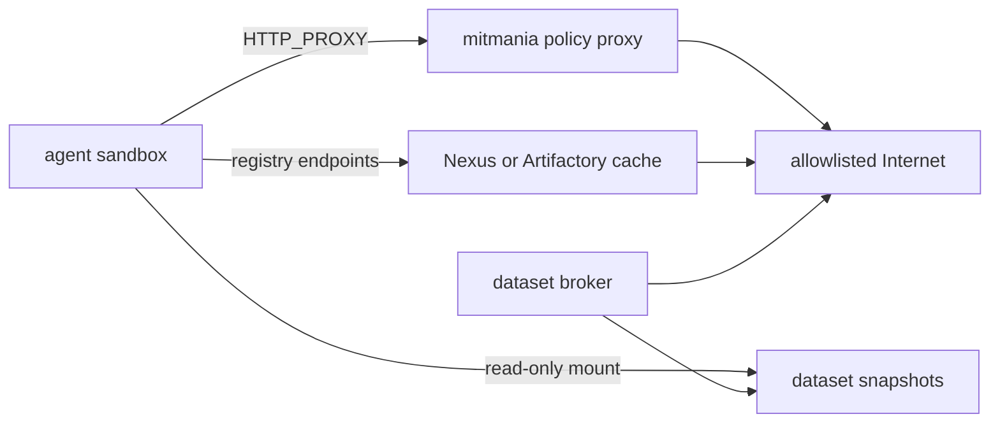

# Docker Sandbox

The `axio-tools-docker` package provides an isolated Docker container for
running agent-generated code and commands. `DockerSandbox` is an async context
manager: it creates a container on entry and removes it on exit. Inside the
context it exposes six tools that are drop-in replacements for
`axio-tools-local` - the agent gets the same `shell`, `write_file`,
`read_file`, `list_files`, `run_python`, and `patch_file` tools, but every
operation runs inside the container, not on the host.

## Installation

```bash
pip install axio-tools-docker
```

Docker must be installed and running on the host. The package communicates with
the Docker Engine API directly via
[aiodocker](https://aiodocker.readthedocs.io/) - the `docker` CLI is not
required.

## Quick start

<!-- name: test_docker_quick_start; fixtures: docker -->
```python
import asyncio
from axio import Agent, MemoryContextStore
from axio.testing import StubTransport, make_text_response
from axio_tools_docker import DockerSandbox

async def main() -> None:
    transport = StubTransport([make_text_response("Done.")])
    async with DockerSandbox(image="python:3.12-alpine") as sandbox:
        agent = Agent(
            system="You are a coding assistant. Use the sandbox tools.",
            tools=sandbox.tools,
            transport=transport,
        )
        result = await agent.run("Print hello from Python.", MemoryContextStore())
        print(result)

asyncio.run(main())
```

## Sandbox tools

The six tools exposed by `sandbox.tools` have the same names and field schemas
as `axio-tools-local`, so switching between local and sandboxed execution
requires changing only the tool list passed to `Agent`.

| Tool | Description |
|------|-------------|
| `shell` | Run a shell command. Returns combined stdout/stderr. Supports `timeout`, `cwd`, and `stdin`. |
| `write_file` | Create or overwrite a file. Parent directories are created automatically. Accepts `file_path`, `content`, and optional `mode`. |
| `read_file` | Read a file with optional `start_line`/`end_line`, `line_numbers`, and `max_chars` truncation. Binary files return hex. |
| `list_files` | List directory contents. Directories appear first with a trailing `/`. |
| `run_python` | Execute a Python snippet in a subprocess inside the container. Supports `timeout`, `cwd`, and `stdin`. |
| `patch_file` | Replace lines `from_line`..`to_line` (1-indexed, inclusive). Set `to_line = from_line - 1` to insert without deleting. Always read the file first with `line_numbers=True`. |

The `tools` property is only valid inside the `async with` block. Accessing it
outside raises `RuntimeError`.

## From axio-repl

`axio-repl --sandbox docker` builds the same sandbox for you. The default is
`--sandbox auto`, which uses a container whenever `aiodocker` is importable and
`/var/run/docker.sock` exists — on a machine with Docker running, the agent is
sandboxed unless you pass `--sandbox none`.

The REPL preserves the invoking process identity and project path. Conceptually,
without network options it creates the container as:

```text
DockerSandbox(
    image=<--sandbox-image>,
    user="<host uid>:<host gid>",
    group_add=[<host supplementary gids>],
    volumes={<absolute cwd>: <absolute cwd>, "/tmp/axio-home": <temporary host directory>},
    read_only_volumes={"/etc/passwd": "/etc/passwd", "/etc/group": "/etc/group"},
    workdir=<absolute cwd>,
    network=False,
)
```

The system prompt and tools therefore use the same absolute project path as the
host. Files created through `write_file` are archived with the numeric runtime
UID/GID instead of becoming root-owned on the host. `HOME=/tmp/axio-home` is a
writable, per-session bind mount backed by a host temporary directory; it is
removed with the sandbox. The real host home is never mounted, and CLI caches
and configuration do not spill into the project.

The defaults give the agent **256 MB of memory and one CPU** — enough for edits
and small scripts, tight for a test suite or a compiler. Override them with
`--sandbox-memory` and `--sandbox-cpus`.

Tools are swapped by name:

| Tool | Where it runs |
|---|---|
| `read_file`, `write_file`, `patch_file`, `list_files`, `shell` | replaced by the container-backed versions |
| `search_files` | reimplemented for the container: the search script is copied in and run with `python3` |
| `ast_grep` | runs `ast-grep` **inside** the container |
| `run_python` | offered only in the sandbox — running arbitrary Python on the host is what the sandbox exists to prevent |
| `spawn_agent`, `send_message`, `list_peers`, `monitor`, `stop_agent`, `interrupt_agent` | left on the host; they touch no files |

Spawned subagents inherit the parent's tools, so one substitution covers the
whole tree.

### Standard agent image

The repository contains a moderately sized universal image based on
`mcr.microsoft.com/devcontainers/base:3-noble`. It includes Python/uv, Node.js,
Go, Rust, OpenJDK, Git, `gh`, `glab`, PDF/OCR utilities, a Python data-analysis
environment, and Kaggle/Hugging Face CLIs.

```bash
make sandbox-image
axio-repl --sandbox docker \
  --sandbox-memory 4g \
  --sandbox-cpus 2
```

`axio-agent-sandbox:standard` is the REPL default. It is deliberately local-only
and is not pulled from a registry: when absent, startup stops with the command
to run `make sandbox-image`. An explicit alternative such as
`--sandbox-image python:3.12-slim` retains the generic Docker behavior and is
pulled when missing. See `docker/agent-sandbox/README.md` for the exact inventory
and build arguments. Keep `python3` in derivative images:
`search_files` and `run_python` both need it.

Dependencies must be baked in for the same reason — with networking off, a
`uv sync` inside the container cannot reach an index. The next section describes
restricted registry access without enabling Docker's routed default network.

### Host identity limitations

Host identity projection is intentionally limited to a local POSIX Docker
client. REPL sandbox startup fails when numeric UID/GID APIs or `/etc/passwd`
and `/etc/group` are unavailable. It also verifies the effective UID/GID,
supplementary numeric group IDs, NSS resolution of the current user and primary
group, exact workdir, writable project and temporary home, and read-only account
database mounts before exposing tools to the agent. Root invocation therefore
runs as root; the REPL does not invent a safer identity.

Both `--sandbox auto` and `--sandbox docker` fail closed when this projection or
its startup verification fails; neither falls back to host tools. Use
`--sandbox none` to make host execution an explicit choice.

Only `/etc/passwd` and `/etc/group` are exposed. `/etc/shadow`, `/etc/gshadow`,
and the host home are not mounted. Supplementary GIDs supplied by an NSS source
other than `/etc/group` remain usable numerically but may not resolve to names
inside the container.

The current user and primary group must exist in the mounted files. Accounts
resolved only through LDAP, SSSD, systemd-homed, macOS Directory Services, or
another non-file NSS backend are not reproduced by these two mounts, so startup
fails instead of running under an unresolved identity. In particular, macOS
Docker Desktop is POSIX on the client side but normally cannot project the
interactive macOS account through its host `/etc/passwd`; use `--sandbox none`
unless a file-based identity visible to the Linux container is configured.

Bind source paths are interpreted by the Docker daemon. A remote daemon cannot
see ordinary client paths, so its mount or the startup verification fails; the
REPL does not silently fall back to another identity or path. Nested mounts are
required when a project lies below `/tmp/axio-home` or includes `/etc`; Docker
on Linux supports them, but unusual daemon/storage configurations can reject
them. An exact collision with `/tmp/axio-home`, or mounting `/` as the project,
is rejected before container creation. Project paths containing `:` are also
rejected because Docker's bind-string representation cannot encode them safely.

### Restricted packages and datasets

Create a user-defined internal network and attach only the sandbox and trusted
service endpoints to it:

```bash
docker network create --internal axio-agent-egress
```

A typical deployment connects these components:



The sandbox is attached only to `axio-agent-egress`, which has Docker
`Internal=true`. mitmania, the package cache, and the dataset broker need a
separately controlled upstream path. Do not attach the sandbox itself to that
upstream network.

mitmania is an HTTP/HTTPS policy data plane, not a package cache and not a
containment boundary. Its own documentation requires a firewall or equivalent
network boundary to prevent direct egress. An internal Docker network supplies
that boundary for this topology; mitmania supplies per-host/path/method policy,
auditing, and optional TLS interception. Nexus or Artifactory supplies caching
and repository grouping.

Point the REPL at those internal services explicitly:

```bash
axio-repl --sandbox docker \
  --sandbox-image axio-agent-sandbox:standard \
  --sandbox-memory 4g \
  --sandbox-cpus 2 \
  --sandbox-network axio-agent-egress \
  --sandbox-proxy http://mitmania:3128 \
  --sandbox-no-proxy nexus \
  --sandbox-pypi-index http://nexus:8081/repository/pypi/simple \
  --sandbox-npm-registry http://nexus:8081/repository/npm/ \
  --sandbox-cargo-index sparse+http://nexus:8081/repository/cargo/ \
  --sandbox-go-proxy http://nexus:8081/repository/go/ \
  --sandbox-go-sumdb 'sum.golang.org https://nexus:8081/repository/sumdb/sum.golang.org' \
  --sandbox-datasets /srv/axio-datasets
```

`axio-repl` verifies that the named Docker network has `Internal=true` before
creating the container, then creates it against that verified network ID rather
than looking it up again by name. Missing, malformed, replaced, and routed
networks fail closed. Proxy and registry flags, read-only data mounts, CA
configuration, and non-default resource limits are rejected instead of silently
falling back to the host when `--sandbox none` is selected or `--sandbox auto`
cannot use Docker.

For an HTTP PyPI mirror, the REPL validates the URL and derives
`PIP_TRUSTED_HOST` and `UV_INSECURE_HOST` from its host and optional port. This
is intentionally weaker transport security and should be limited to the
isolated internal network; prefer an HTTPS mirror. Credentials, query strings,
and fragments are rejected in the configured URL.

Cargo source replacement cannot be implemented by changing the registry-index
environment variable alone. The REPL generates a temporary Cargo config with
`[source.crates-io] replace-with = "axio-mirror"`, mounts it read-only at
`/tmp/axio-cargo/config.toml`, and points `CARGO_HOME` there. It does not modify
the project's `.cargo/config.toml`. A project-local Cargo config has higher
precedence, so the internal Docker network and proxy policy remain the actual
fail-closed egress boundary.

`GOPROXY` controls Go module downloads but does not by itself proxy the public
checksum database. By default the REPL leaves Go's `GOSUMDB` behavior unchanged;
the policy proxy must allow that traffic or the operator must explicitly set an
internal checksum database/proxy with `--sandbox-go-sumdb`. Do not silently set
`GOSUMDB=off`: that removes an integrity check.

Do not embed credentials in endpoint URLs: command lines, shell history, and
Docker container metadata are not secret stores. Prefer an unauthenticated
cache reachable only on the internal network, or let mitmania/broker policy
inject narrowly scoped credentials without exposing them to the sandbox.

The dataset path is mounted read-only at `/datasets`. A broker outside the
sandbox should validate provider, dataset ID, immutable revision, license, file
types, and size; download to content-addressed storage; then publish an approved
snapshot under that host directory. The `kaggle` and `hf` binaries in the image
do not bypass this policy. Avoid passing upload/delete credentials to the
sandbox if its job is dataset consumption.

For TLS interception, add `--sandbox-ca-cert /path/to/egress-ca-bundle.pem`.
This must be a complete CA bundle containing the normal system roots plus the
interception CA: several of the Python, uv, Git, curl, and Cargo variables set
by this flag replace those clients' default bundle rather than extending it
(`NODE_EXTRA_CA_CERTS` extends Node's trust instead).
Java tools need a corresponding JVM truststore baked into the image or
configured through Maven/Gradle; the PEM flag does not mutate the system or JVM
trust stores. `wget` does not honor these per-client CA variables; use `curl` or
configure its trust separately. With mitmania `mitm:false`, no interception CA
is needed and TLS remains end-to-end. `--sandbox-no-proxy` is only for trusted
internal service names: it bypasses the HTTP proxy, not the internal-network
containment boundary.

Ubuntu's system Python in the standard image is externally managed under PEP
668. Use `uv add`, `uv sync`, or `uvx` for project dependencies and one-off
tools; do not rely on global `pip install`. The `python-data` command selects
the baked data-analysis environment.

## Container lifecycle

`DockerSandbox` creates and starts the container in `__aenter__`. On
`__aexit__` the container is force-removed (`docker rm -f`) unless `remove=False`
was passed. Cleanup runs even when the body raises an exception.

The container runs `sleep infinity` as its main process; all tool operations
are executed via `docker exec`. The image is pulled automatically if not
present locally.

The `container_id` property returns the Docker ID of the running container and
is only valid inside the `async with` block:

<!-- name: test_docker_container_id; fixtures: docker -->
```python
import asyncio
from axio_tools_docker import DockerSandbox

async def main() -> None:
    async with DockerSandbox(image="alpine:latest") as sandbox:
        print(sandbox.container_id)   # e.g. "3f2a1b..."
        result = await sandbox.exec("uname -r")
        print(result)
    # container removed here

asyncio.run(main())
```

## Named containers and reuse

Pass `name=` to give the container a fixed name. When a running container with
that name already exists, the sandbox attaches to it instead of creating a new
one and skips removal on exit regardless of `remove`:

<!-- name: test_docker_named_reuse; fixtures: docker -->
```python
import asyncio
from axio_tools_docker import DockerSandbox

async def first_session() -> None:
    async with DockerSandbox(
        image="python:3.12-slim",
        name="my-sandbox",
        remove=False,
    ) as sandbox:
        await sandbox.exec("pip install requests")

async def second_session() -> None:
    # Attaches to the existing container - requests is already installed
    async with DockerSandbox(name="my-sandbox") as sandbox:
        result = await sandbox.exec(
            "python3 -c 'import requests; print(requests.__version__)'"
        )
        print(result)

asyncio.run(first_session())
asyncio.run(second_session())
```

If no container with the given name exists, a new one is created normally.

## Named volumes

Named volumes are managed by the Docker daemon independently of any container.
They persist across container restarts and can be shared between sandbox sessions.
Pass `named_volumes=` as a `{container_path: volume_name}` mapping:

<!-- name: test_docker_named_volumes; fixtures: docker -->
```python
import asyncio
from axio_tools_docker import DockerSandbox

async def main() -> None:
    # First session: write data to the volume
    async with DockerSandbox(
        image="python:3.12-alpine",
        named_volumes={"/data": "my-project-data"},
    ) as sb:
        await sb.write_file("/data/state.json", '{"count": 1}')
    # Container is removed, but the volume survives.

    # Second session: data is still there
    async with DockerSandbox(
        image="python:3.12-alpine",
        named_volumes={"/data": "my-project-data"},
        volumes_remove=True,   # remove the volume on exit
    ) as sb:
        raw = await sb.read_file_bytes("/data/state.json")
        print(raw.decode())   # {"count": 1}
    # Volume is now removed as well.

asyncio.run(main())
```

Docker creates the volume automatically if it does not exist yet.

Set `volumes_remove=True` to delete the named volumes when the sandbox exits.
This has no effect when attaching to an existing container (`name=` reuse).

## Resource limits

Use `ulimits` to cap resource usage inside the container. A plain integer sets
soft and hard to the same value; a `(soft, hard)` tuple sets them
independently:

<!-- name: test_docker_ulimits -->
```python
from axio_tools_docker import DockerSandbox

sandbox = DockerSandbox(
    image="python:3.12-slim",
    ulimits={
        "nofile": (1024, 65536),   # open file descriptors: soft 1024, hard 65536
        "nproc": 512,              # max processes: soft=hard=512
    },
)
```

Combined with a memory cap and CPU limit this gives strong containment for
untrusted code:

<!-- name: test_docker_containment -->
```python
from axio_tools_docker import DockerSandbox

sandbox = DockerSandbox(
    image="python:3.12-slim",
    memory="256m",
    cpus="1.0",
    network=False,
    ulimits={"nofile": (256, 256), "nproc": 128},
    tmpfs={"/tmp": "size=64m,mode=1777"},
    read_only=True,
)
```

## Hardened sandbox

For maximum isolation combine `read_only`, `tmpfs`, `cap_drop`, and disabled
networking:

<!-- name: test_docker_hardened -->
```python
from axio_tools_docker import DockerSandbox

sandbox = DockerSandbox(
    image="python:3.12-slim",
    memory="256m",
    cpus="1.0",
    network=False,
    read_only=True,
    cap_drop=["ALL"],
    ulimits={"nofile": (256, 256), "nproc": 128},
    tmpfs={
        "/tmp": "size=64m,mode=1777",
        "/workspace": "size=512m",
    },
    workdir="/workspace",
)
```

With this configuration the agent can only write to `/tmp` and `/workspace`,
has no network access, no Linux capabilities, and cannot exceed the memory or
process limits.

## All parameters

<!-- name: test_docker_all_params -->
```python
from axio_tools_docker import DockerSandbox

sandbox = DockerSandbox(
    "unix:///var/run/docker.sock",   # Docker daemon URL (positional)
    image="python:3.12-slim",
    memory="512m",
    cpus="2.0",
    network=False,
    workdir="/workspace",
    volumes={"/workspace": "/tmp/host-dir"},
    read_only_volumes={"/datasets": "/srv/datasets"},
    named_volumes={"/data": "my-project-data"},
    volumes_remove=False,
    env={"PYTHONPATH": "/app"},
    user="nobody",
    group_add=["20", "998"],
    name="my-sandbox",
    remove=False,
    read_only=True,
    shm_size="64m",
    cap_add=["NET_ADMIN"],
    cap_drop=["ALL"],
    privileged=False,
    ulimits={"nofile": (1024, 65536), "nproc": 512},
    tmpfs={"/tmp": "size=128m,mode=1777"},
    ports={8080: 8080},
    platform="linux/amd64",
    extra_hosts={"host.docker.internal": "host-gateway"},
    devices=["/dev/net/tun"],
    dns=["8.8.8.8", "1.1.1.1"],
    require_internal_network=False,
    pull_missing=True,
)
```

| Parameter | Type | Default | Description |
|-----------|------|---------|-------------|
| `url` | `str` | `"unix:///var/run/docker.sock"` | Docker daemon URL. Positional. |
| `image` | `str` | `"python:latest"` | Container image. Pulled automatically if not present locally. |
| `memory` | `str` | `"256m"` | Memory limit. Accepts `k`/`m`/`g` suffixes (e.g. `"512m"`, `"1g"`). |
| `cpus` | `str` | `"1.0"` | CPU limit as a decimal string. |
| `network` | `bool \| str` | `False` | Network mode. `False` → `none`. `True` → Docker default. String → explicit `NetworkMode` (e.g. `"host"`, `"bridge"`, `"my-project_default"`). |
| `workdir` | `str` | `"/workspace"` | Working directory inside the container. Relative paths in tool calls resolve against this. |
| `volumes` | `dict[str, str]` | `{}` | Bind mounts as `{container_path: host_path}`. |
| `read_only_volumes` | `dict[str, str]` | `{}` | Read-only bind mounts as `{container_path: host_path}`. |
| `named_volumes` | `dict[str, str]` | `{}` | Named Docker volumes as `{container_path: volume_name}`. Created automatically if absent. |
| `volumes_remove` | `bool` | `False` | Remove named volumes on exit. No effect when attached to an existing container. |
| `env` | `dict[str, str]` | `{}` | Environment variables passed to all commands. |
| `user` | `str` | `""` | User to run as (e.g. `"nobody"`, `"1000"`). |
| `group_add` | `list[str]` | `[]` | Supplementary group names or numeric IDs. |
| `name` | `str` | `""` | Container name. Attaches to existing container if running; creates new one otherwise. |
| `remove` | `bool` | `True` | Remove container on exit. No effect when attached to an existing container. |
| `read_only` | `bool` | `False` | Read-only root filesystem. Combine with `tmpfs` for writable scratch space. |
| `shm_size` | `str` | `""` | `/dev/shm` size (e.g. `"64m"`). Useful for PyTorch and shared-memory IPC. |
| `cap_add` | `list[str]` | `[]` | Linux capabilities to add (e.g. `["NET_ADMIN", "SYS_PTRACE"]`). |
| `cap_drop` | `list[str]` | `[]` | Linux capabilities to drop (e.g. `["ALL"]`). |
| `privileged` | `bool` | `False` | Extended privileges - full capability set and device access. Use with care. |
| `ulimits` | `dict[str, int \| tuple[int, int]]` | `{}` | Resource limits. `{"nofile": 1024}` → soft=hard=1024. `{"nofile": (1024, 65536)}` → soft/hard split. |
| `tmpfs` | `dict[str, str]` | `{}` | Tmpfs mounts as `{path: options}` (e.g. `{"/tmp": "size=128m,mode=1777"}`). Empty string uses Docker defaults. |
| `ports` | `dict[int, int]` | `{}` | Port bindings as `{container_port: host_port}`. Only meaningful when `network != False`. |
| `platform` | `str` | `""` | Platform override (e.g. `"linux/amd64"`, `"linux/arm64"`). |
| `extra_hosts` | `dict[str, str]` | `{}` | Extra `/etc/hosts` entries as `{hostname: ip}` (e.g. `{"host.docker.internal": "host-gateway"}`). |
| `devices` | `list[str]` | `[]` | Host devices to expose. Format: `"/dev/sda"` (same container path, `rwm`), `"/dev/sda:/dev/xvda"` (custom path), `"/dev/sda:/dev/xvda:r"` (explicit permissions). |
| `dns` | `list[str]` | `[]` | DNS servers (e.g. `["8.8.8.8", "1.1.1.1"]`). Only meaningful when `network != False`. |
| `require_internal_network` | `bool` | `False` | Require a named network whose Docker metadata has `Internal=true`, then create against its verified ID; fail before container creation otherwise. Incompatible with `name` reuse. |
| `pull_missing` | `bool` | `True` | Pull an absent image. Set false for a local-only image and receive `ImageNotAvailableError` instead. |

## Docker daemon not available

If the daemon is unreachable, `__aenter__` raises immediately with a clear message:

```
RuntimeError: Docker daemon not available at 'unix:///var/run/docker.sock': ...
```

Common causes:

- Docker Desktop is not running - start it and try again.
- Wrong socket path - pass the correct `url` or set `DOCKER_HOST`.
- Permission denied - on Linux, add your user to the `docker` group:
  ```bash
  sudo usermod -aG docker $USER
  ```

## Low-level API

`DockerSandbox` exposes the methods the built-in tools use internally. You can
call these directly for custom container interaction:

| Method | Description |
|--------|-------------|
| `await sandbox.exec(command, timeout=30, stdin=None)` | Run a shell command; returns stdout/stderr as a string. |
| `await sandbox.write_file(path, content, mode=0o644)` | Write a string to a file inside the container. |
| `await sandbox.read_file_bytes(path)` | Read a file and return raw bytes. |
| `await sandbox.get_archive(path)` | Fetch a path from the container as a `tarfile.TarFile`. |
